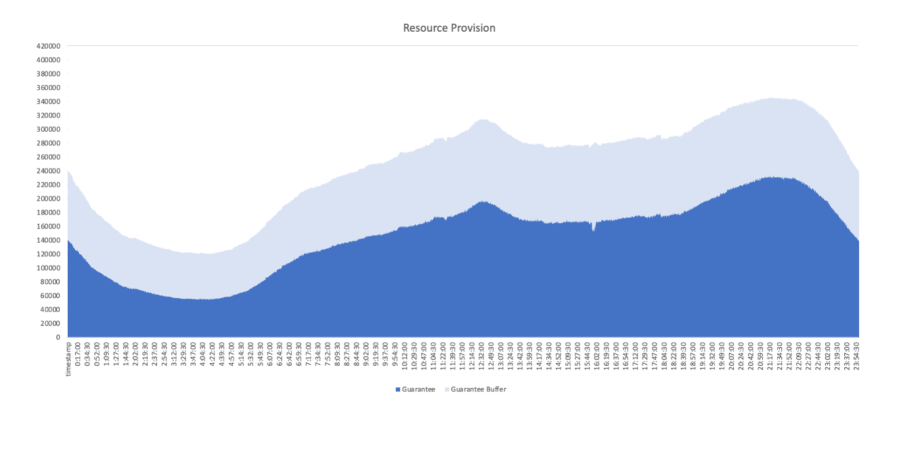
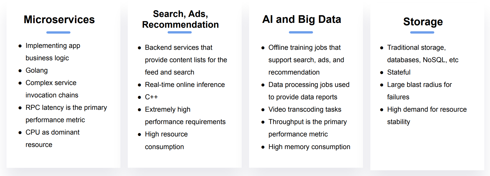
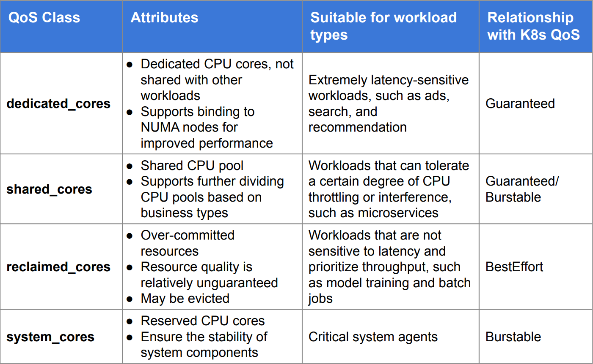
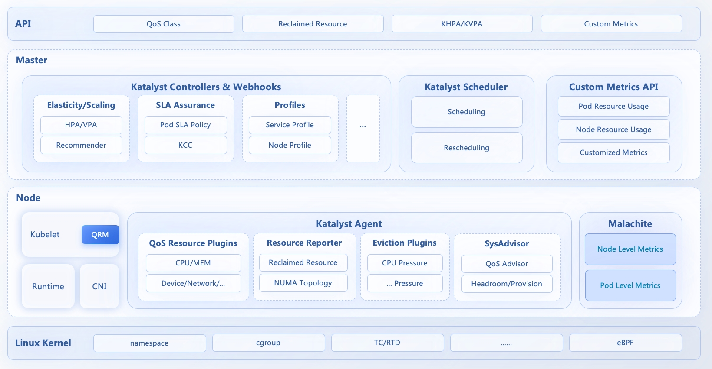
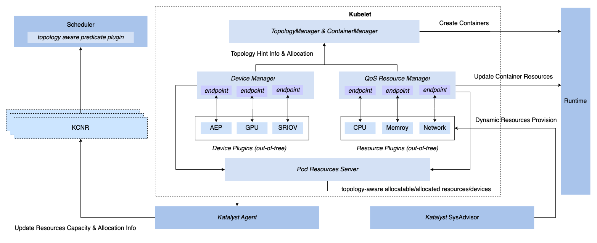
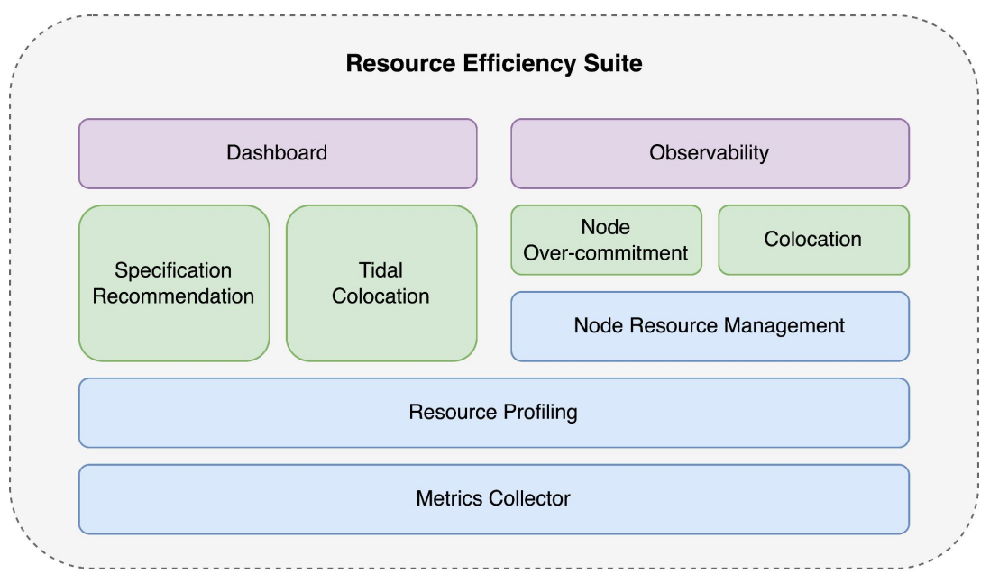

The resource usage of web applications tends to fluctuate with changes in the number of visitors, displaying noticeable tidal characteristics. To ensure stability, service providers often allocate resources for their applications according to resource usage during peak periods. These resources can easily be underutilized during off-peak hours.
 

  <picture>
    
  </picture>

 

If these idle resources can be reclaimed and temporarily allocated to lower-priority services and returned promptly to online services when needed, the overall resource utilization rate can be significantly improved.

## ByteDance colocation practices
ByteDance operates at a massive scale with diverse business types, encompassing various categories such as microservices, advertising, machine learning, big data, and storage. Typically, different business types have distinct resource management requirements at the infrastructure level. The conventional approach involves segmenting resource pools based on business lines or service types to meet customized demands.

However, this method of resource pool segmentation can lead to resource silos, preventing flexible resource sharing and hindering the overall efficiency of resource utilization and cost optimization. It also adds to the operational burden of managing clusters.

Furthermore, considering that different types of businesses have complementary SLO requirements and resource usage patterns, the infrastructure team aims to leverage these characteristics fully. They do so through scheduling and control mechanisms to optimize resource efficiency, achieve the convergence and consolidation of resource pools, and assist business teams in attaining lower resource costs and greater elasticity.
 

  <picture>
    
  </picture>

 
 

To achieve unified resource management, ByteDance began building a unified infrastructure based on Kubernetes in 2016. At the current stage, ByteDance has essentially completed the containerization of all microservices, advertising, and a significant portion of machine learning and big data businesses. Throughout this process, the infrastructure team has continued to explore resource optimization methods under a unified resource pool and gradually developed a resource pool deployment approach that combines 'elastic scaling' and 'colocation.'
Elastic Scaling: This enables machine-level and Numa-level resource time-sharing, combining business and system metrics to guide horizontal and vertical scaling strategies for application instances. This ultimately allows offline services to purchase more idle resources at a lower cost, and online services to purchase more peak-time resources at a higher cost through resource market-oriented operations, leading to overall efficiency improvement.

Colocation: It offers the ability to oversell resources, making full use of 'sold but underutilized resources' in the cluster to deploy more low-priority tasks. Simultaneously, we enhance resource isolation mechanisms across multiple dimensions such as CPU, memory, disk, and network at the system level. Minute-level control mechanisms, combined with intelligent load prediction algorithms, are adopted to ensure service stability according to their SLOs.

This solution combines Kubernetes and Yarn systems for joint control. It runs control components of both Kubernetes and Yarn on the same machine, and coordinates the allocatable resources between the two systems through a central coordination component. On top of this joint control system, we achieve real-time resource estimation based on service resource profiles, ensuring more flexible and dynamic resource allocation while meeting various service SLA requirements.

During the implementation of this colocation solution, the infrastructure team verified the feasibility of resource pooling, constructed the foundational capabilities for colocation, and improved the overall utilization of core clusters from 23% to 60%.
 

  <picture>
    
  </picture>

 
 

## Katalyst: From Internal Validation to Open Source
After undergoing extensive testing with businesses like  Douyin and Toutiao, which have large-scale tidal traffic, ByteDance's cloud-native colocation practices have matured. In order to help end users in cloud native community understand the principles behind large-scale colocation practices and improve overall resource efficiency of their own, we have refactored and enhanced the resource management system in a Kubernetes Native manner and built the resource management system "Katalyst", which has now been officially open-sourced.
The name "Katalyst" is derived from the word "catalyst," and the 'K' symbolizes its ability to provide enhanced automation for resource management for all workloads running within the Kubernetes ecosystem.

### What Is Katalyst
Katalyst originated from ByteDance's colocation practices and has been extended and supplemented in terms of resource management capabilities:
- Developed entirely within the context of hyperscale colocation practices, achieving true reuse of internal and external technology systems.
- Built based on a plugin-based architecture, allowing users to customize various modules such as scheduling, control strategies on top of the Katalyst Framework.
- Provides one-click deployment templates and comprehensive operation manuals, reducing the understanding and deployment costs for end users.

### Resource Abstraction
The native Kubernetes Quality of Service (QoS)  system does not meet the requirements of large-scale production environments, prompting Katalyst to build a QoS system of its own.
Katalyst defines four QoS classes including dedicated_cores, shared_cores, reclaimed_cores and system_cores. Users can assign different QoS class to their applications according to different QoS requirements. Based on our practices in Bytedance, CPU, in most scenarios, is a dominant resource that can affect applications' performance and users tend to associate QoS requirements with CPU as well. So despite the fact that QoS requirement encompasses various kinds of resources(i.e. CPU, memory, disk io, network bandwidth etc), we named it after CPU. Each level is accompanied by various enhancement mechanisms (e.g., whether NUMA node binding is required or if network affinity and bandwidth restrictions are necessary), enabling differentiated resource allocation and control strategies.
 

  <picture>
    
  </picture>

 
 

Through this abstract resource model, Katalyst provides users with a unified resource entry point. Users can accurately express their specific needs by mapping business services to the appropriate QoS class and sales model based on business requirements. This ultimately allows users to obtain resources from a unified resource pool without needing to delve into the underlying  details.
 

  <picture>
    
  </picture>

 
 

### Overall Architecture
In the early stages, the colocation architecture had several issues: although the joint control of Kubernetes and Yarn systems achieved colocation of online and offline businesses, the complexity of the system incurs more maintenance costs.
Additionally, this architecture led to resource usage overhead. It comes from the resource consumption of agents running on each node. While resource consumption on an individual node is not significant, the accumulated overhead in hyperscale clusters can be substantial. Moreover, the use of two control systems increased system complexity. Any abnormalities at any stage could lead to resource calculation errors.
In Katalyst, we optimized and refactored the overall colocation architecture:
 

  <picture>
    
  </picture>

 
 

At the control layer, we integrated the fusion system based on both Kubernetes and Yarn systems into a single Kubernetes-based system.
Specifically, we retained the API entry points for Kubernetes and Yarn at the access layer, while unifying metadata management and resource control implementation within Katalyst, which is Kubernetes-native.

At the scheduling layer, Katalyst implemented a coordinated resource scheduling and control mechanism between "centralized scheduling" and "node resource management" based on unified metadata.

On the node side: Katalyst extends Kubernetes with a module named QoS Resource Manager (QRM). This module enables plugin-based node-level topology affinity allocation and reports the topology to the control plane through custom CRDs, facilitating scheduling processes. At runtime, Katalyst continuously makes estimation for resource allocation according to system metrics, service level indicators and QoS requirements of the pods. The allocation result is then dynamically sent to the Container Runtime Interface (CRI) through the QRM reconcile loops. The resource estimation algorithm and QRM implementation can be customized through plugins, making resource control strategies more adaptable to different business scenarios.

On the scheduling side: Katalyst extends scheduler with richer scheduling capabilities through scheduler framework. During scheduling, it takes into account how applications of different QoS classes should allocate and collaborate resources when running in the same cluster. The scheduler also combines real-time data and service profiles to do dynamic rebalancing across the entire cluster, reducing cluster vacancy rates and enhancing business stability.
 

  <picture>
    
  </picture>

 
 

Lastly, under a unified control system, we can fully leverage Kubernetes' advantages in API design. By decoupling internal systems and generalizing control strategies through custom CRDs, we are able to iteratively improve the system through a plugin-based approach, achieving true convergence between internal and external systems.

## RoadMap
Katalyst, as a resource management system, has colocation as one of its core business scenarios. In addition to abstracting the core concepts mentioned above, we have provided and planned various QoS capabilities for Katalyst:
- Fine-grained resource estimation strategies: Katalyst supports multiple resource estimation strategies including heuristics, unsupervised learning, and QoS-aware algorithms, improving resource utilization by accurately calculating and predicting the amount of resources that can be reclaimed from the nodes.
- Multi-dimensional resource isolation capabilities: Using technologies such as cgroup, RDT, iocost, tc, etc., Katalyst achieves effective isolation of various resources, including CPU, memory, disk, and network, in different colocation scenarios.
- Multi-level load eviction strategies: Katalyst supports multi-level eviction strategies based on various metrics, ensuring online business QoS  while maximizing offline business QoS.

Besides colocation, Katalyst also provides enhanced resource management capabilities:
- Recommendation and autoscaling: Katalyst provides enhanced VPA/HPA capabilities and advanced recommendation algorithms. This helps end users make a more accurate estimation of pod resource request/limit or replica numbers, hence improve deployment rates and resource utilization.
- Tidal(Exclusive-mode) colocation: While colocating online and offline applications on the same node gives more resource efficiency improvement, it requires all the infrastructure intricacies(e.g. Resource isolation, scheduling etc.) to work smoothly, which makes the overall system complicated. Katalyst provides an exclusive-mode colocation where the resource is reclaimed in node granularity so that either online or offline applications can run on the same node simultaneously. This allows users to improve resource efficiency at a lower operation cost.
- Node overcommitment: With node overcommitment, Katalyst allows the scheduler to schedule more pods to a node without end users' awareness. Meanwhile, Katalyst adopts methods like interference detection and mitigation, node resource prediction algorithm and so forth to guarantee the QoS requirement of higher priority tasks.
- ...
 

  <picture>
    
  </picture>

 
 

For detailed plans, please refer to the roadmap.
Besides, we have just given a brief introduction about Katalyst at Kubecon China. You can also refer to [our talk](https://sched.co/1RSk1) for more information.

While colocation has undergone several iterations within ByteDance, a universal, standardized platform foundation must be refined through various scenarios. We look forward to your participation in the Katalyst community and sharing your scenarios and requirements for colocation, resource efficiency improvement and so forth.

